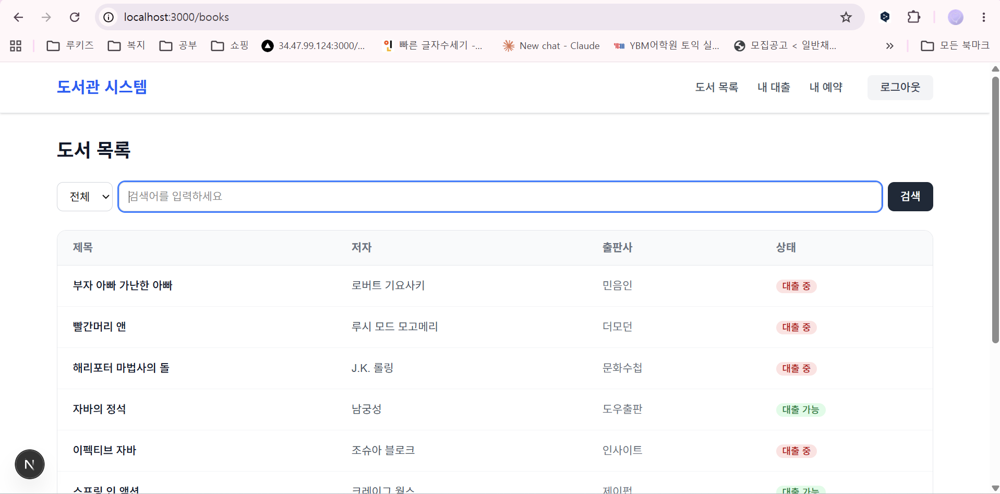
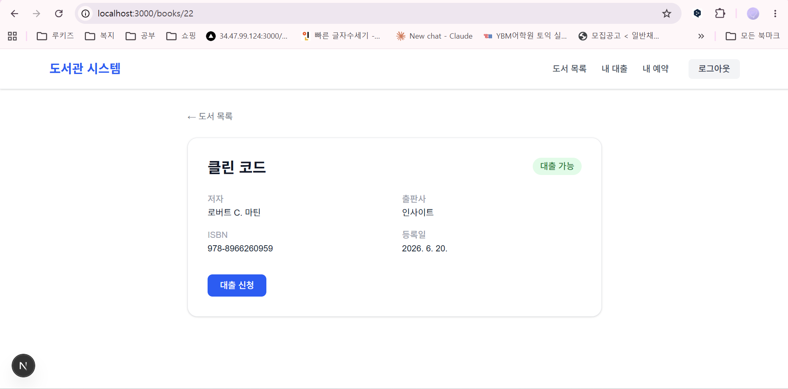
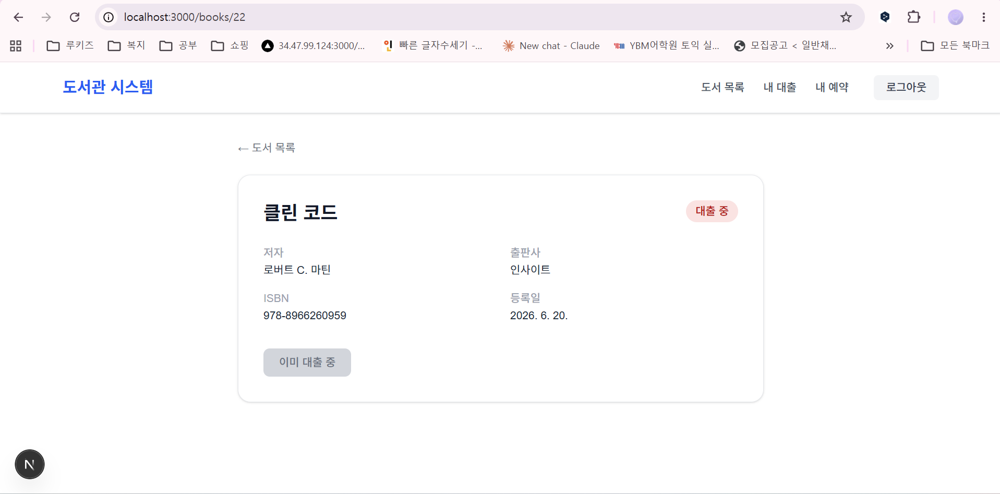
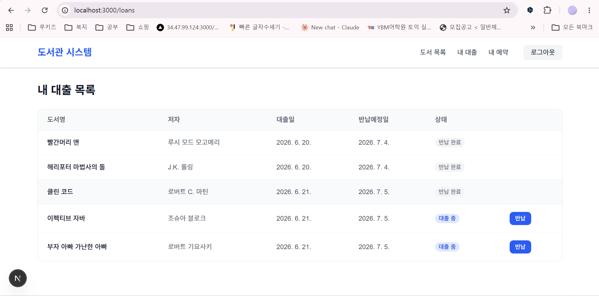
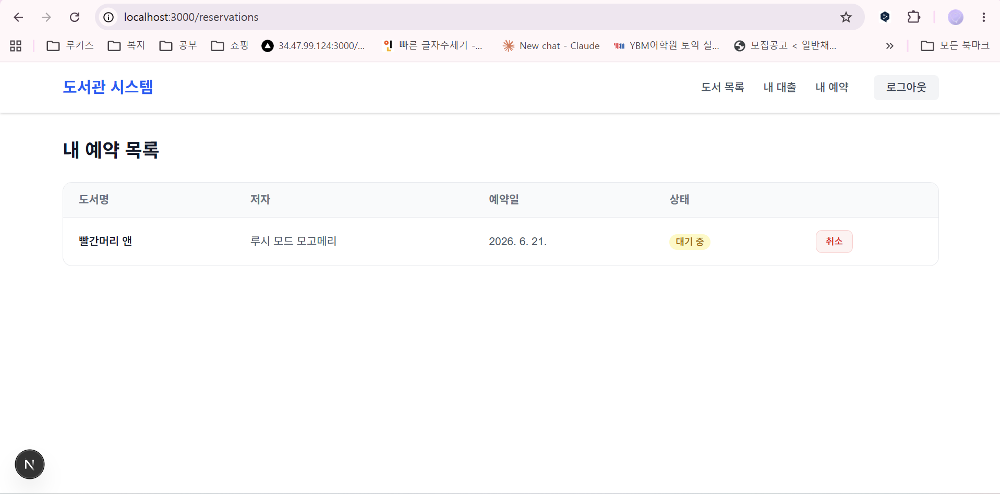
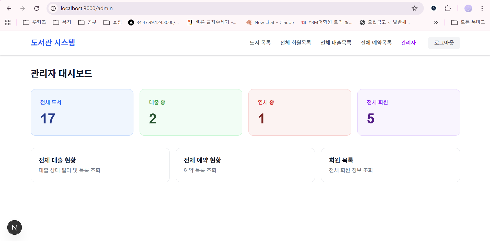
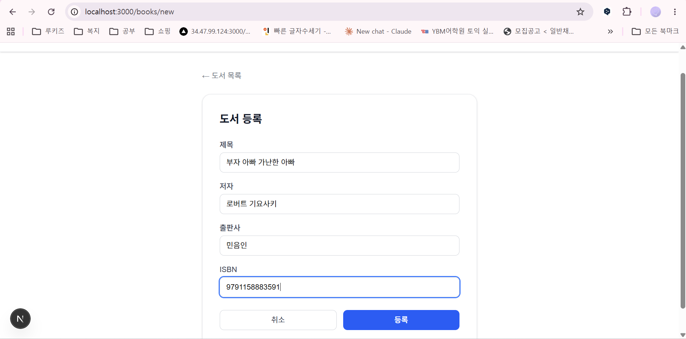
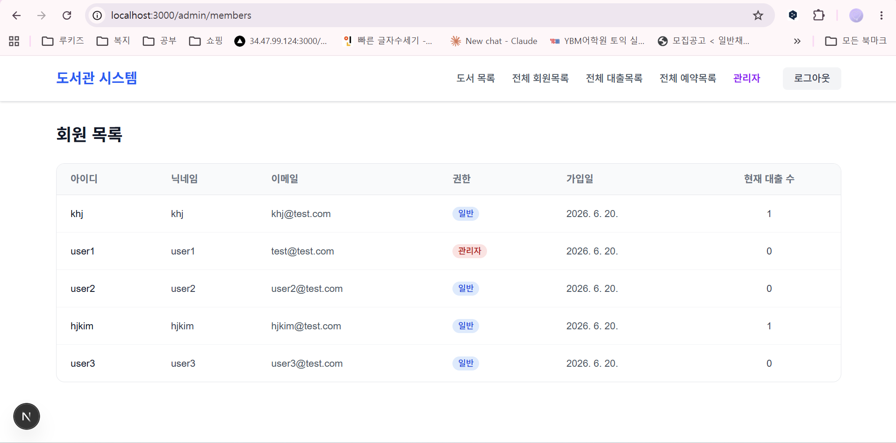
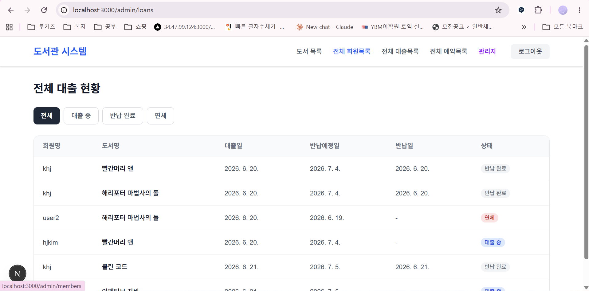
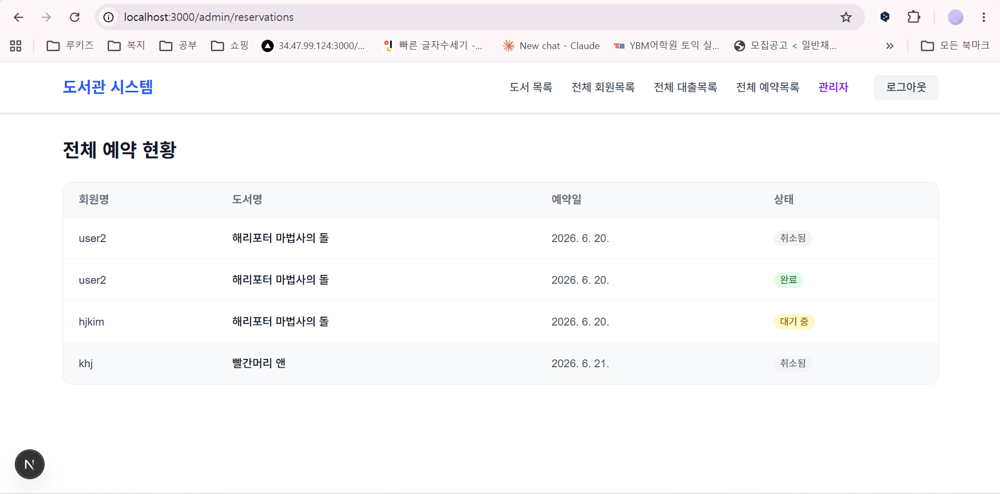

# 📚 도서관 대출 관리 시스템 - Frontend

> Spring Boot REST API와 연동한 Next.js 기반 도서관 대출 관리 웹 애플리케이션.
> 회원 인증, 도서 검색, 대출/반납/예약, 관리자 기능을 구현한 풀스택 프로젝트의 프론트엔드입니다.

---

## 🛠 기술 스택

| 분류 | 기술 |
|---|---|
| Framework | Next.js 15 (App Router) |
| Language | TypeScript |
| Styling | Tailwind CSS |
| HTTP | axios (JWT 인터셉터) |
| Infra | Docker, Docker Compose |

---

## 🖼 화면 예시

### 도서 목록


### 도서 상세 - 대출 전 / 대출 후



### 내 대출 내역


### 내 예약 내역


### 관리자 대시보드


### 관리자 도서 등록


### 관리자 회원 목록


### 관리자 대출 현황


### 관리자 예약 현황


---

## 📌 주요 기능

### 일반 회원
- 회원가입 / 로그인 / 로그아웃 (JWT 인증)
- 도서 목록 조회 (제목/저자/전체 검색, 페이징)
- 도서 상세 조회 및 상태 확인
- 대출 신청 / 반납 처리
- 예약 신청 / 취소
- 내 대출 목록 / 내 예약 목록 조회

### 관리자
- 관리자 대시보드 (전체 도서·대출·연체·회원 현황)
- 도서 등록 / 수정 / 삭제
- 전체 대출 현황 (상태별 필터)
- 전체 예약 현황
- 전체 회원 목록 (권한·현재 대출 수 표시)

---

## 💡 주요 구현 포인트

| 항목 | 내용 |
|---|---|
| JWT 자동 처리 | axios 인터셉터로 모든 요청에 Authorization 헤더 자동 추가 |
| 권한별 UI 분리 | ROLE_ADMIN / ROLE_USER에 따라 네비게이션 및 버튼 노출 제어 |
| 도서 상태 뱃지 | AVAILABLE(초록) / LOANED(빨강) / RESERVED(노랑) 색상 구분 |
| 대출 상태 뱃지 | ACTIVE(파랑) / RETURNED(회색) / OVERDUE(빨강) 색상 구분 |
| 인증 가드 | 비로그인 접근 시 /auth/login으로 자동 리다이렉트 |
| 관리자 가드 | 비관리자 접근 시 /books로 자동 리다이렉트 |
| 환경변수 분리 | NEXT_PUBLIC_API_URL로 API 주소 관리 |

---

## 📁 페이지 구조

```
/                        → /books 리다이렉트
/books                   도서 목록 (검색, 페이징)
/books/[id]              도서 상세 (대출/예약 버튼)
/books/new               도서 등록 (관리자)
/books/edit/[id]         도서 수정 (관리자)
/loans                   내 대출 목록
/reservations            내 예약 목록
/admin                   관리자 대시보드
/admin/loans             전체 대출 현황
/admin/reservations      전체 예약 현황
/admin/members           회원 목록
/auth/login              로그인
/auth/register           회원가입
```

---

## 🚀 실행 방법

### 로컬 실행
```bash
npm install
npm run dev
```
브라우저에서 http://localhost:3000 접속

### Docker 실행
```bash
docker-compose up --build
```

> ⚠️ 백엔드(library-api)가 먼저 실행되어 있어야 합니다.

---

## 🔗 백엔드 Repository

> https://github.com/kimgywls/library-api